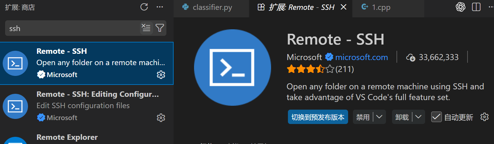
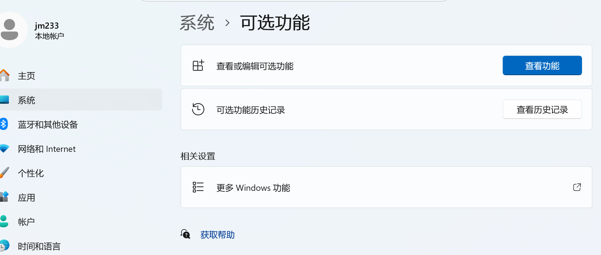
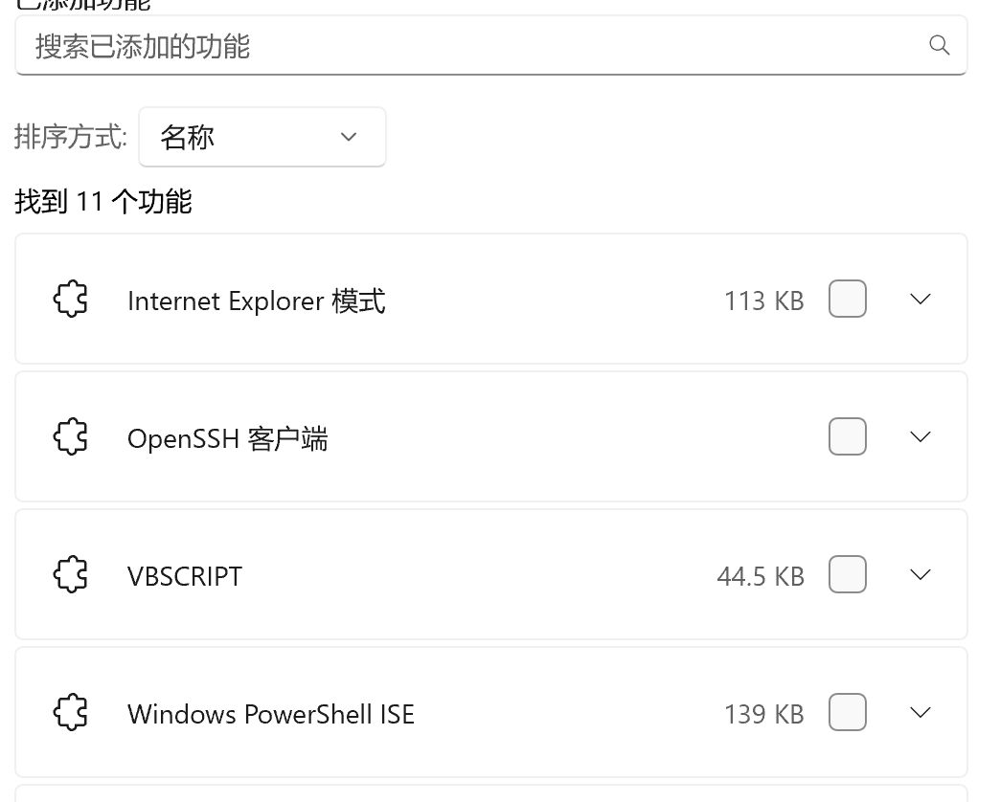
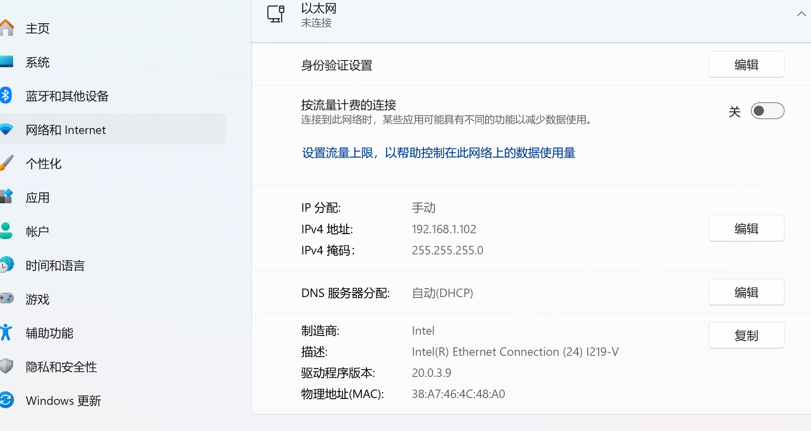
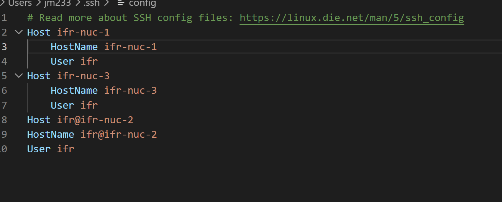

# 调车方法 README

本文根据现有文字说明与配图整理，按实际操作顺序说明如何完成环境准备、SSH 连接、网络配置与调参运行。

---

## 1. 在 VS Code 扩展中安装 Remote - SSH

先打开 VS Code 的扩展商店，搜索 **Remote - SSH**，安装微软官方扩展。



---

## 2. 在 Windows 可选功能中安装 OpenSSH 客户端

进入：

**设置 → 系统 → 可选功能 → 查看功能**

确认已经安装 **OpenSSH 客户端**。如果没有安装，请先安装后再继续后续步骤。





---

## 3. 配置以太网 IP

进入：

**设置 → 网络和 Internet → 以太网**

将 IP 设置为**手动配置**。

### 可用配置
- 旧版 IPv4：`192.168.1.102`
- 新版（NUC 电脑）IPv4：`192.168.1.173`
- IPv4 掩码：`255.255.255.0`

> 注意：截图中展示的是旧版配置示例。



---

## 4. 配置 SSH 的 `config` 文件

在本机 SSH 配置文件中添加目标主机信息。根据示例，可在 `~/.ssh/config` 中写入类似内容：

```ssh-config
Host ifr-nuc-1
    HostName ifr-nuc-1
    User ifr

Host ifr-nuc-3
    HostName ifr-nuc-3
    User ifr

Host ifr@ifr-nuc-2
    HostName ifr@ifr-nuc-2
    User ifr
```

### 登录说明
- 登录密码统一为：`ifr`



---

## 5. 连接 SSH 并找到参数配置文件

通过 VS Code 连接到远程主机后：

1. 打开远程文件夹  
2. 找到 `rm-aim-launch` 目录下的 `config` 文件夹  
3. 里面一般会有 `local.yaml` 文件  

### 如果没有 `local.yaml`
可以手动新建一个 `local.yaml`，再把 `default.yaml` 中的参数粘贴进去。

### 调参位置
一般都在 `local.yaml` 中修改参数。

---

## 6. 运行前准备：安装 Foxglove

实际运行时通常**看不到图像界面**，所以需要提前安装 **Foxglove**，用于查看相关数据与画面信息。

---

## 7. 启动桥连脚本

在终端中先运行桥连脚本：

```bash
./deploy/fs-bridge.bash
```

该步骤用于建立桥连，便于后续调试和查看数据。

---

## 8. 启动调参脚本

再新建一个终端运行调参脚本：

```bash
./task.bash 5 4，6(6结尾是步兵，7结尾是哨兵)
```


用于重启流程并使新的参数生效。

---

## 9. 推荐操作顺序总结

1. 安装 VS Code 的 Remote - SSH 扩展  
2. 安装 Windows 的 OpenSSH 客户端  
3. 配置以太网静态 IP  
4. 配置本机 `~/.ssh/config`  
5. 通过 SSH 连接远程设备  
6. 进入 `rm-aim-launch/config`  
7. 修改或新建 `local.yaml`  
8. 安装并打开 Foxglove  
9. 运行 `./deploy/fs-bridge.bash`  
10. 运行 `./task.bash` 进入对应进程  
11. 改完参数后再次运行 `./task.bash` 重启

---

## 附：关键参数与命令速查

### IP 配置
- 旧版：`192.168.1.102`
- 新版（NUC）：`192.168.1.173`
- 掩码：`255.255.255.0`

### SSH 登录
- 用户：`ifr`
- 密码：`ifr`

### 常用脚本
```bash
./deploy/fs-bridge.bash
./task.bash
```
